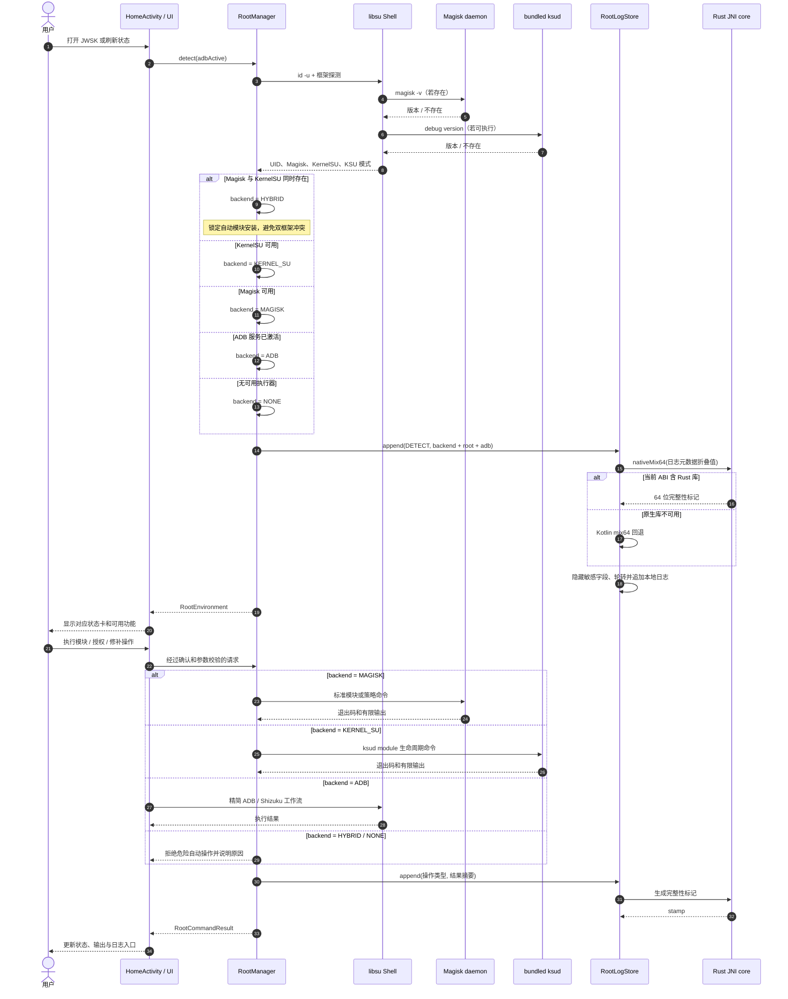

# Root detection and journaling flow

JWSK resolves one active execution backend before exposing privileged actions.
Detection and every privileged operation produce a bounded local journal entry;
the journal records metadata and result summaries, not raw secret-bearing user
commands.

The Rust boundary accepts a primitive `Long` only. Java-owned strings and byte
buffers remain in the Kotlin/Java layer, and a behavior-compatible Kotlin
fallback keeps unsupported ABIs functional.
