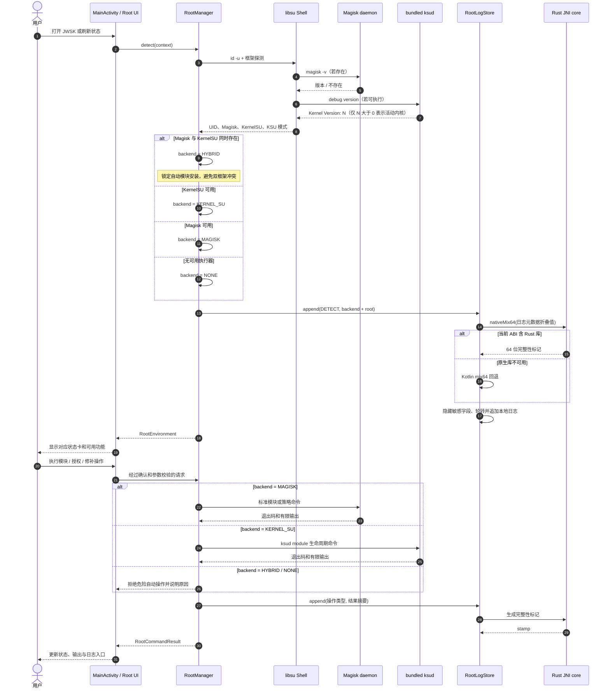

# Root detection and journaling flow

JWSK resolves one active execution backend before exposing privileged actions.
Detection and every privileged operation produce a bounded local journal entry;
the journal records metadata and result summaries, not raw secret-bearing user
commands.

```mermaid
sequenceDiagram
    autonumber
    actor User as 用户
    participant UI as MainActivity / Root UI
    participant RM as RootManager
    participant Shell as libsu Shell
    participant Magisk as Magisk daemon
    participant KSU as bundled ksud
    participant Log as RootLogStore
    participant Rust as Rust JNI core

    User->>UI: 打开 JWSK 或刷新状态
    UI->>RM: detect(context)
    RM->>Shell: id -u + 框架探测
    Shell->>Magisk: magisk -v（若存在）
    Magisk-->>Shell: 版本 / 不存在
    Shell->>KSU: debug version（若可执行）
    KSU-->>Shell: Kernel Version: N（仅 N 大于 0 表示活动内核）
    Shell-->>RM: UID、Magisk、KernelSU、KSU 模式

    alt Magisk 与 KernelSU 同时存在
        RM->>RM: backend = HYBRID
        Note over RM: 锁定自动模块安装，避免双框架冲突
    else KernelSU 可用
        RM->>RM: backend = KERNEL_SU
    else Magisk 可用
        RM->>RM: backend = MAGISK
    else 无可用执行器
        RM->>RM: backend = NONE
    end

    RM->>Log: append(DETECT, backend + root)
    Log->>Rust: nativeMix64(日志元数据折叠值)
    alt 当前 ABI 含 Rust 库
        Rust-->>Log: 64 位完整性标记
    else 原生库不可用
        Log->>Log: Kotlin mix64 回退
    end
    Log->>Log: 隐藏敏感字段、轮转并追加本地日志
    RM-->>UI: RootEnvironment
    UI-->>User: 显示对应状态卡和可用功能

    User->>UI: 执行模块 / 授权 / 修补操作
    UI->>RM: 经过确认和参数校验的请求
    alt backend = MAGISK
        RM->>Magisk: 标准模块或策略命令
        Magisk-->>RM: 退出码和有限输出
    else backend = KERNEL_SU
        RM->>KSU: ksud module 生命周期命令
        KSU-->>RM: 退出码和有限输出
    else backend = HYBRID / NONE
        RM-->>UI: 拒绝危险自动操作并说明原因
    end
    RM->>Log: append(操作类型, 结果摘要)
    Log->>Rust: 生成完整性标记
    Rust-->>Log: stamp
    RM-->>UI: RootCommandResult
    UI-->>User: 更新状态、输出与日志入口
```

The Rust boundary accepts a primitive `Long` only. Java-owned strings and byte
buffers remain in the Kotlin/Java layer, and a behavior-compatible Kotlin
fallback keeps unsupported ABIs functional.

The bundled ksud binary is also available on Magisk devices. Its mere presence,
a zero kernel version, or leftover `/data/adb/ksu` files never enables KernelSU
mode. A refresh recreates a previously denied libsu session. Privileged
operations check the shell's actual Root status before execution.

Rust API version and deterministic vectors are checked when loading JNI.
The SplitMix64 journal stamp is a diagnostic checksum, not a cryptographic
signature or proof against deliberate tampering. File SHA-256 is calculated
with Java's streaming MessageDigest implementation.
